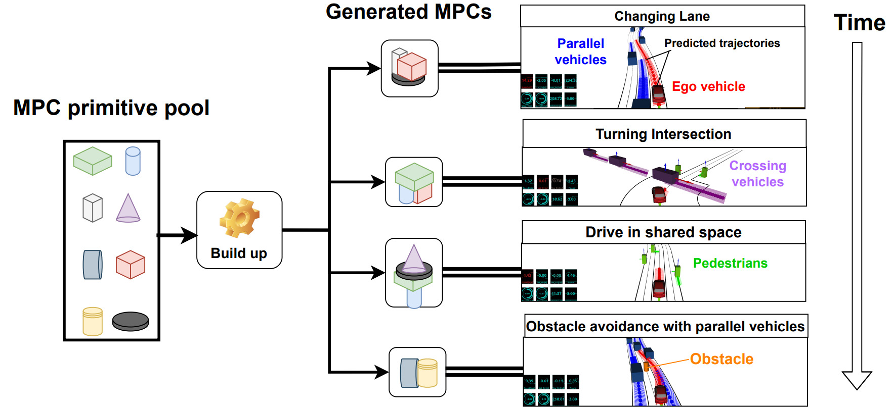

{: align="center"}
**Kohei Honda, Hiroyuki Okuda, Akira Ito, and Tatsuya Suzuki**

{: align="center"}
**In Review**

## Abstract

This study presents a new framework for vehicle motion planning and control based on the automatic generation of model predictive controllers (MPC) named MPC Builder. In this framework, several components necessary for MPC, such as models, constraints, and cost functions, are prepared in advance. The MPC Builder then online generates various MPCs according to traffic situations in a unified manner. This scheme enabled us to represent various driving tasks with minimal design effort. The proposed framework was implemented considering the continuation/generalized minimum residual (C/GMRES) method optimization solver, which can reduce computational costs. Finally, numerical experiments on multiple driving scenarios were presented.

## Video



## Links

- [Preprint paper](https://arxiv.org/abs/2210.16512)
